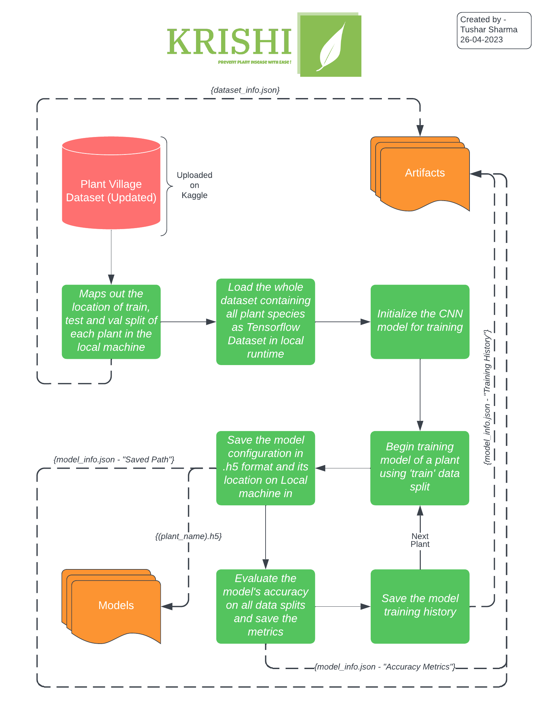

# __KRISHI__
    

## Introduction
Krishi is a web application that allows users to detect diseases in plants by simply uploading pictures of their leaves. The application currently supports the detection of upto 21 common deseases in 9 different plants with an accuracy of more than 95%.  

#### Demo Video -

    

| Plant | Disease |
| --- | --- |
| Apple | ◈ Black Rot ◈ Apple Scab ◈ Cedar Apple Rust |
| Bell Pepper | ◈ Bacterial Spot |
| Cherry | ◈ Powdery Mildew |
| Corn (Maize) | ◈ Common Rust ◈ Cercospora Leaf Spot ◈ Northern Leaf Blight |
| Grape | ◈ Black Rot ◈ Esca (Black Measles) ◈ Leaf Blight |
| Peach | ◈ Bacterial Spot |
| Potato | ◈ Early Blight ◈ Late Blight |
| Strawberry | ◈ Leaf Scorch |
| Tomato | ◈ Bacterial Spot ◈ Early Blight ◈ Late Blight ◈ Septoria Leaf Spot ◈ Yellow Leaf Curl Virus |

## Workflow

    

## Getting started
To use the application, you can visit the live version hosted on the following URL:

   `https://project-krishi.azurewebsites.net/`
    
Alternatively, you can run the application on your local machine by following the steps below:

1. Clone the repository to your local machine by running the following command:  

		git clone https://github.com/tushar-mahalya/Krishi.git
    
2. Install the necessary dependencies by running the following command:

		pip install -r requirements.txt

3. Start the application by running the following command:

		python app.py
    
4. Open your web browser and navigate to the following URL:

		http://localhost:5000/

💡NOTE: There might be a possibility that the website deployed could be taken down in the future due to constraints on server resources. In such an event, we kindly suggest running the website on your local machine if you encounter any difficulties accessing the web application.

## Hardware Specification

For this project I've used [Amazon Sagemaker Studio Lab](https://studiolab.sagemaker.aws/) EC2-Instance which have the following specs -

| Component | Specification |
| --- | --- |
| CPU | Intel® Xeon® Platinum 8259CL |
| Architecture | x86_64 |
| RAM | 16GB |
| Storage | 15GB (AWS S3 Bucket) |
| GPU | NVIDIA® Tesla T4 |
| CUDA Version | 11.4 |
| V-RAM | 15GB |

## Contributing

If you would like to contribute to the project, you can follow the steps below:

1. Fork the repository to your GitHub account.
2. Clone the repository to your local machine.
3. Create a new branch for your changes.
4. Make your changes to the codebase.
5. Push your changes to your forked repository.
6. Create a pull request from your forked repository to the original repository.

## License

This project is licensed under the MIT License. You are free to use, modify and distribute the code as per the license terms.
